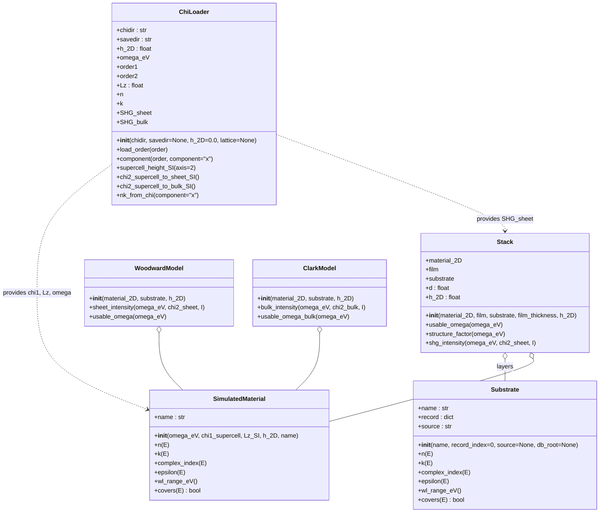
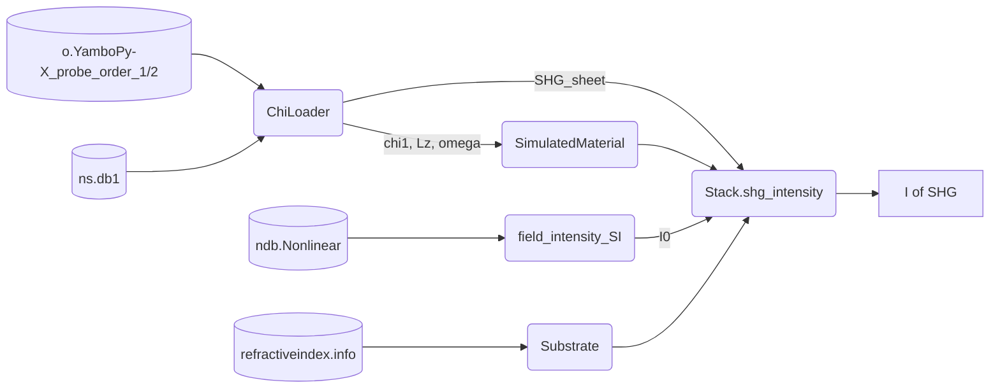

# `shg_intensity`: documentation

#### Myrta Grüning, Corey Nelson

This document describes the `shg_intensity` module, part of the `YamboPy` code, for converting the nonlinear susceptibilities extracted by `Xn_from_signal` into measurable second-harmonic generation (SHG) intensities for a 2D material in a layered structure (air / 2D material / dielectric film / substrate).

Unless stated otherwise, all quantities in the module's public interface are SI — lengths in m, intensities in W m$^{-2}$, sheet susceptibilities in m$^2$ V$^{-1}$ — with two deliberate exceptions: photon energies are passed in eV, and the raw `o.YamboPy-X_probe` spectra are in Gaussian (esu) units, converted on loading.

---

## 0. Minimal theoretical compendium

**Sheet susceptibility.** `yambo`/`lumen` computes the susceptibility averaged over the whole supercell of height $L_z$, most of which is vacuum. The physically meaningful 2D quantity is the *sheet* susceptibility, obtained by undoing the vacuum dilution and converting from Gaussian (esu) to SI units,

$$ \chi^{(2)}_s = \frac{4\pi}{c\cdot 10^{-4}} \cdot L_z \cdot \chi^{(2)}_{\text{supercell}}, \qquad [\chi^{(2)}_s] = \text{m}^2/\text{V}. $$

Bulk-equivalent values quoted in the literature (pm/V) are $\chi^{(2)}_s/h$ with $h$ the monolayer thickness, and therefore depend on the (conventional) choice of $h$.

**Structure factor.** For a normally incident plane wave of intensity $I$ at frequency $\omega$ on the structure air / 2D material / film($d$) / substrate, the SH intensity is (Song et al. [1], built on the sheet-optics framework of Cheng et al. [2])

$$ I(2\omega) = \frac{1}{2\epsilon_0 c} \cdot |\beta|^2 \cdot \left|\frac{2\pi \cdot \chi^{(2)}_s}{\lambda}\right|^2 \cdot I^2, \qquad \beta = (1+R_\omega)^2 \cdot (1+R_{2\omega}), $$

where $R_\omega$, $R_{2\omega}$ are the reflection coefficients of the full structure at the fundamental and harmonic. All interference effects are contained in $\beta$; $|\beta|^2 \in [0, 64]$, with the extremes corresponding to fully destructive/constructive interference at both frequencies. $R$ is built from the Fresnel coefficients $r_{ij} = (n_i - n_j)/(n_i + n_j)$, the film phase $e^{2i\tilde\omega n_1 d}$, and the monolayer sheet term $\eta = -\tfrac{i}{2} \cdot h \cdot \tilde\omega \cdot (n_{2D}^2 - 1)$ with $\tilde\omega = 2\pi/\lambda$.

**Single-interface limit.** For the 2D material directly on a bare transparent substrate ($d = 0$), the expression reduces to the strict-SI single-interface formula (Woodward et al. [3], Eq. (1)),

$$ I(2\omega) = \frac{32 \cdot \omega^2 \cdot |\chi^{(2)}_s|^2}{\epsilon_0 \cdot c^3 \cdot (1+n)^6} \cdot I^2 . $$

**Note on unit conventions.** The frequently cited sheet formula of Clark et al. [4], Eq. (1), carries the prefactor $512\pi^2 = 32\cdot(4\pi)^2$: a residual $(4\pi)^2$ from an incomplete Gaussian-to-SI conversion of Bloembergen & Pershan [5], whose radiated fields scale as $4\pi P^{\rm NLS}$ in Gaussian units (the correct SI translation replaces $4\pi P$ by $P/\epsilon_0$). For a given SI $\chi^{(2)}_s$ it therefore overestimates $I(2\omega)$ by $(4\pi)^2 \simeq 158$, and susceptibilities extracted with that pipeline are $4\pi$ below strict-SI values. The module retains Clark's Eq. (4) (bulk thin-slab reference formula, cf. Butcher & Cotter [6] Eq. 7.27) for comparison with that literature.

**Effective optical constants of the monolayer.** The Fresnel factors require an effective refractive index for the 2D layer. It is obtained from the linear susceptibility of the same run through the sheet-corrected Gaussian relation

$$ \epsilon = 1 + 4\pi \cdot \frac{L_z}{h} \cdot \chi^{(1)}_{\text{supercell}}, \qquad \tilde n = n + ik = \sqrt{\epsilon}, $$

a thin-bulk-slab approximation consistent with the $\eta$ sheet term above. These are effective quantities intended for the transfer-matrix model, not literal monolayer properties.

---

## 1. Code

### 1.1 Input

Three outputs of a `yambo_nl` run analysed with `Xn_from_sine` are required:

1. `o.YamboPy-X_probe_order_1`, `_2` — the $\chi^{(1)}$, $\chi^{(2)}$ spectra written by `output_analysis` (Gaussian units). The column layout is `E[eV], Im(x), Re(x), Im(y), Re(y), Im(z), Re(z)` and is fixed for all files, so the loader carries all three Cartesian components together;
2. `SAVE/ns.db1` — the lattice database, read with `YamboLatticeDB`, providing the supercell height $L_z$;
3. `SAVE/ndb.Nonlinear` — the field database, providing the applied intensity $I$ (variable `Field_Intensity_1`, atomic units).

Substrate optical constants are taken from the [refractiveindex.info](https://refractiveindex.info) database via the `refractiveindex` python package [7], which auto-downloads the database on first use (configurable through the `REFRACTIVEINDEX_DB` environment variable).

### 1.2 Structure

The module is a single file, `yambopy/nl/shg_intensity.py`. The recommended entry point is the `ChiLoader` class, which bundles one run and calls the lower-level conversion functions internally. The public interface is organised as:

1. **`ChiLoader`** — the primary interface. One instance represents one run: it loads both the $\chi^{(1)}$ and $\chi^{(2)}$ spectra (all three Cartesian components), reads the lattice, and exposes the unit conversions as methods that store their results on the object;
2. **Unit conversions and yambo I/O (lower-level functions)** — `chi2_supercell_to_sheet_SI`, `sheet_to_bulk_chi2`, `nk_from_chi1_supercell`, `intensity_au_to_SI`, and the loaders `load_chi_order`, `supercell_height_SI`, `field_intensity_SI`. `ChiLoader` wraps these; they remain available for scripting outside the class;
3. **Database access** — keyword search and record loading over the refractiveindex.info catalog (`search_database`, `print_search`, `load_material`, `load_catalog`, `get_n`, `get_k`, `get_epsilon`, `database_version`);
4. **Material objects** — `Substrate` (database optical constants) and `SimulatedMaterial` (effective constants from the run's own $\chi^{(1)}$). Both expose the same interface — `n(E)`, `k(E)`, `complex_index(E)`, `epsilon(E)`, `wl_range_eV()`, `covers(E)` — so the models accept them interchangeably;
5. **SHG intensity models** — `Stack` (structure-factor model, general case), `WoodwardModel` (single-interface strict SI), `ClarkModel` (bulk reference formula, Eq. (4) of [4]).

Energies outside a layer's data range at either $\omega$ or $2\omega$ yield `NaN` rather than extrapolated values.

### 1.3 Class diagram



### 1.4 Sequence of operations

```mermaid
sequenceDiagram
    participant U as user
    participant C as ChiLoader
    participant S as Stack
    participant M as materials (2D, film, substrate)

U->>C: ChiLoader(chidir, savedir, h_2D)
Note over C: loads chi1 and chi2 (x, y, z),<br/>reads the lattice
U->>C: supercell_height_SI(); chi2_supercell_to_sheet_SI()
C-->>U: CHI.Lz, CHI.SHG_sheet
U->>S: shg_intensity(omega_eV, SHG_sheet[:, 0], I0)
S->>S: usable_omega(omega_eV)
Note over S: keep energies where every layer<br/>has data at omega AND 2*omega
S->>M: complex_index(omega), complex_index(2*omega)
S->>S: R_total at omega and 2*omega
S->>S: beta = (1+R_w)^2 (1+R_2w)
S-->>U: I(2w) = |beta|^2 |2pi chi_s / lambda|^2 I^2 / (2 eps0 c)
```

---

## 2. How to use

The diagram below shows the workflow, continuing from `Xn_from_signal`: the `o.YamboPy-X_probe_order_?` files written by `output_analysis` are the input here.



Every snippet assumes:

```python
from yambopy import *
from yambopy.nl.shg_intensity import *
```

### Example 1: load a run and form the sheet susceptibility

One `ChiLoader` represents one run. Constructing it loads both spectra (all three Cartesian components) and opens the lattice database; `h_2D` is the effective monolayer thickness in m. The conversion methods store their results on the object. For a flat monolayer (point group $D_{3h}$) the out-of-plane response is forbidden by symmetry, so the $z$ component should read numerically zero — a quick sanity check on the run — while $x$ and $y$ are the two symmetry-related in-plane components.

```python
CHI = ChiLoader('.', 'SAVE', h_2D=0.65e-9)

assert np.allclose(CHI.component(2, 'z'), 0.0)     # D3h: no out-of-plane chi2

CHI.supercell_height_SI()          # -> CHI.Lz (m)
CHI.chi2_supercell_to_sheet_SI()   # -> CHI.SHG_sheet (m^2/V), all components
CHI.chi2_supercell_to_bulk_SI()    # -> CHI.SHG_bulk  (m/V),  for pm/V literature
CHI.nk_from_chi()                  # -> CHI.n, CHI.k
```

`CHI.omega_eV` is the run's photon-energy grid (eV). `CHI.SHG_sheet` and `CHI.SHG_bulk` have shape $(N, 3)$; pick a component with `CHI.SHG_sheet[:, 0]` ($x$) or `CHI.component(2, 'y')`.

The same conversions are available as standalone functions for scripting outside the class — `load_chi_order`, `supercell_height_SI`, `chi2_supercell_to_sheet_SI`, `sheet_to_bulk_chi2`, `nk_from_chi1_supercell` — which `ChiLoader` calls internally.

### Example 2: SHG intensity of $\text{MoS}_2 / \text{SiO}_2(285\,\text{nm}) / \text{Si}$

The 2D material is built from the run's own $\chi^{(1)}$; the substrates from the refractiveindex.info database (`print_search("SiO2")` lists the available records with their energy ranges; selection by `source=` is stable against database updates, selection by index is not). The pump intensity of the run is read from `ndb.Nonlinear`. `structure_factor` may be inspected separately from the intensity.

```python
MoS2   = SimulatedMaterial(CHI.omega_eV, CHI.component(1, 'x'),
                           CHI.Lz, CHI.h_2D, name="MoS2")
silica = Substrate("SiO2", record_index=8)
si     = Substrate("Si",   record_index=200)
I0     = field_intensity_SI('SAVE/ndb.Nonlinear')

stack = Stack(MoS2, silica, si, film_thickness=285e-9, h_2D=CHI.h_2D)
beta  = stack.structure_factor(CHI.omega_eV)
I_shg = stack.shg_intensity(CHI.omega_eV, CHI.SHG_sheet[:, 0], I0)
```

### Example 3: model cross-check on a bare substrate

At $d = 0$ on a transparent substrate, `Stack` and `WoodwardModel` describe the same physics through independent code paths; their ratio should be $\simeq 1$. This check is recommended once per new dataset.

```python
stack0 = Stack(MoS2, silica, silica, film_thickness=0.0, h_2D=CHI.h_2D)
I_st0  = stack0.shg_intensity(CHI.omega_eV, CHI.SHG_sheet[:, 0], I0)
I_wood = WoodwardModel(MoS2, silica, CHI.h_2D).sheet_intensity(
             CHI.omega_eV, CHI.SHG_sheet[:, 0], I0)

# ratio should be ~1.0 across the usable range
```

`ClarkModel` provides the bulk thin-slab reference (Clark's Eq. (4)); note it takes the **bulk-equivalent** $\chi^{(2)}$:

```python
I_bulk = ClarkModel(MoS2, silica, CHI.h_2D).bulk_intensity(
             CHI.omega_eV, CHI.SHG_bulk[:, 0], I0)
```

---

## Bibliography

1. Song Y, Wang W, Wang Y, Shan Y, Cheng JL, Sipe JE, [Opt. Express 31, 19746 (2023)](https://doi.org/10.1364/OE.486719)
2. Cheng JL, Sipe JE, Vermeulen N, Guo C, [J. Phys. Photonics 1, 015002 (2019)](https://doi.org/10.1088/2515-7647/aaeadb)
3. Woodward RI et al., [2D Mater. 4, 011006 (2017)](https://doi.org/10.1088/2053-1583/4/1/011006)
4. Clark DJ et al., [Phys. Rev. B 90, 121409(R) (2014)](https://doi.org/10.1103/PhysRevB.90.121409)
5. Bloembergen N, Pershan PS, [Phys. Rev. 128, 606 (1962)](https://doi.org/10.1103/PhysRev.128.606)
6. Butcher PN, Cotter D. The Elements of Nonlinear Optics. Cambridge University Press; 1990. [doi.org/10.1017/CBO9781139167994](https://doi.org/10.1017/CBO9781139167994)
7. M. N. Polyanskiy. Refractiveindex.info database of optical constants. Sci. Data 11, 94 (2024). [doi.org/10.1038/s41597-023-02898-2](https://doi.org/10.1038/s41597-023-02898-2)
